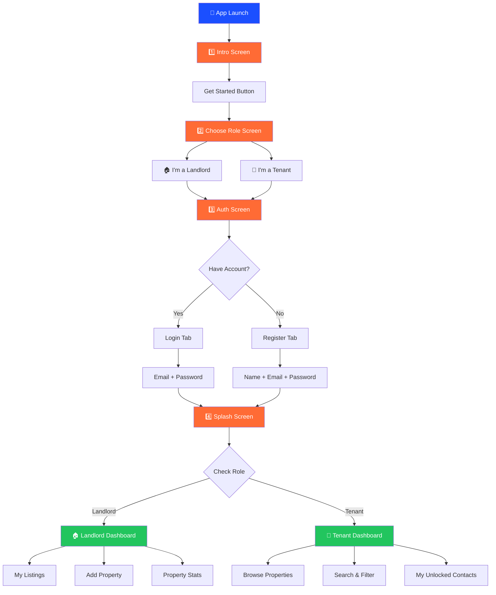
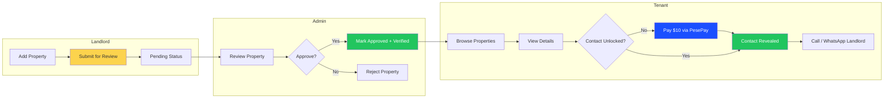
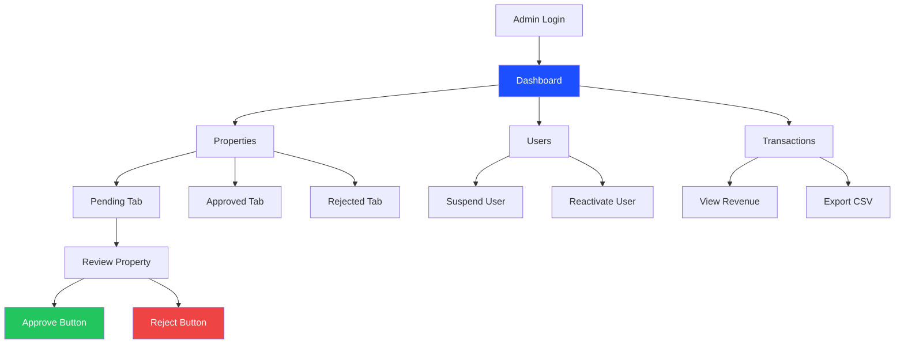

# RentOut App Workflow Diagram
## Client-Friendly Flowchart | March 2026

---

## User Journey Through the App



---

## Core Business Workflow (Property Listing → Unlock)



---

## Screen-by-Screen Breakdown

### 1. INTRO SCREEN
```
┌─────────────────────────┐
│                         │
│      [LOGO/ICON]        │
│                         │
│   Welcome to RentOut    │
│                         │
│   Find your perfect     │
│   rental or list your   │
│   property              │
│                         │
│   [Get Started →]       │
│                         │
└─────────────────────────┘
```

### 2. CHOOSE ROLE SCREEN
```
┌─────────────────────────┐
│    I want to...         │
│                         │
│  ┌─────────────────┐    │
│  │    🏠           │    │
│  │   LANDLORD      │    │
│  │                 │    │
│  │ List properties │    │
│  │ & earn money    │    │
│  └─────────────────┘    │
│                         │
│  ┌─────────────────┐    │
│  │    🔑           │    │
│  │    TENANT       │    │
│  │                 │    │
│  │ Find rentals    │    │
│  │ Pay $10 to      │    │
│  │ unlock contacts │    │
│  └─────────────────┘    │
│                         │
└─────────────────────────┘
```

### 3. AUTH SCREEN (Tabs)
```
┌─────────────────────────┐
│  ┌───────┐ ┌───────┐   │
│  │ LOGIN │ │REGISTER│   │
│  └───┬───┘ └───────┘   │
│      │                 │
│  Email: [           ]   │
│                         │
│  Password: [        ]   │
│                         │
│  [  Sign In  ]          │
│                         │
│  Forgot Password?       │
│                         │
└─────────────────────────┘
```

### 4. SPLASH SCREEN
```
┌─────────────────────────┐
│                         │
│      [ANIMATED          │
│        LOGO]            │
│                         │
│   Setting up your       │
│   experience...         │
│                         │
│      [spinner]          │
│                         │
└─────────────────────────┘
```

---

## Landlord Dashboard Flow

```
┌─────────────────────────┐
│  🏠 LANDLORD DASHBOARD  │
├─────────────────────────┤
│                         │
│  [STATS OVERVIEW]       │
│  ┌────┐┌────┐┌────┐    │
│  │ 5  ││ 3  ││ 2  │    │
│  │Total││Appr││Pend│    │
│  └────┘└────┘└────┘    │
│                         │
│  [MY LISTINGS]          │
│  ┌─────────────────┐    │
│  │ 🏠 Villa in... │ ✅ │
│  │    $500/mo     │Verif│
│  │    [Edit] [Del]│    │
│  └─────────────────┘    │
│                         │
│  ┌─────────────────┐    │
│  │ 🏠 Apartment... │ ⏳ │
│  │    $350/mo     │Pend │
│  │    [Edit] [Del]│    │
│  └─────────────────┘    │
│                         │
│  [  + Add Property  ]   │
└─────────────────────────┘
```

---

## Tenant Dashboard Flow

```
┌─────────────────────────┐
│   🔑 TENANT DASHBOARD   │
├─────────────────────────┤
│                         │
│  🔍 Search...           │
│                         │
│  [Filters] [City ▼]     │
│                         │
│  ┌─────────────────┐    │
│  │  [🏠 IMAGE]     │    │
│  │  Villa in Avondale│   │
│  │  $500/mo • 3 bed  │   │
│  │  ✅ Verified      │   │
│  │  📍 Harare        │    │
│  └─────────────────┘    │
│                         │
│  ┌─────────────────┐    │
│  │  [🏠 IMAGE]     │    │
│  │  Apartment in...│    │
│  │  $350/mo • 2 bed  │   │
│  │  ✅ Verified      │   │
│  └─────────────────┘    │
│                         │
│  [My Unlocked 🔑]       │
└─────────────────────────┘
```

---

## Property Detail & Unlock Flow

```
┌─────────────────────────┐     ┌─────────────────────────┐
│   PROPERTY DETAILS      │     │     PAYMENT SCREEN      │
├─────────────────────────┤     ├─────────────────────────┤
│  [FULL WIDTH IMAGE]     │────▶│                         │
│                         │     │  Unlock Contact         │
│  🏠 Villa in Avondale   │     │                         │
│  ✅ Verified by RentOut │     │  Property:             │
│  $500/month             │     │  Villa in Avondale      │
│  3 bedrooms • 2 bath    │     │                         │
│                         │     │  Amount:                │
│  📍 Location: Avondale  │     │  $10.00 USD             │
│  📅 Available: Now      │     │                         │
│                         │     │  ┌─────────────────┐    │
│  📞 Contact:            │     │  │  PesePay        │    │
│  ••••••••••            │     │  │  Visa/Mastercard│    │
│                         │     │  │  Ecocash        │    │
│  [Unlock - $10 →]       │     │  │  OneMoney       │    │
│                         │     │  └─────────────────┘    │
│  [Report Listing]       │     │                         │
│                         │     │  [ Pay $10 to Unlock ]  │
└─────────────────────────┘     └─────────────────────────┘
                                          │
                                          ▼
                          ┌─────────────────────────┐
                          │    PAYMENT SUCCESS      │
                          ├─────────────────────────┤
                          │                         │
                          │      ✅ UNLOCKED!       │
                          │                         │
                          │  📞 0772 123 456        │
                          │                         │
                          │  [  Call  ] [WhatsApp]  │
                          │                         │
                          │  [← Back to Property]   │
                          └─────────────────────────┘
```

---

## Admin Web Panel Flow



---

## Simple Text Summary

```
┌─────────────────────────────────────────────────────────────────┐
│                      USER APP FLOW                              │
├─────────────────────────────────────────────────────────────────┤
│                                                                 │
│  1. INTRO        →  Welcome + Get Started                      │
│       │                                                         │
│       ▼                                                         │
│  2. CHOOSE ROLE  →  Landlord OR Tenant                         │
│       │                                                         │
│       ▼                                                         │
│  3. AUTH         →  Login OR Register                            │
│       │                                                         │
│       ▼                                                         │
│  4. SPLASH       →  Loading + Auto-redirect                    │
│       │                                                         │
│       ▼                                                         │
│  5. DASHBOARD    →  Role-based:                                 │
│       • Landlord → Manage properties                            │
│       • Tenant   → Browse + Pay $10 for contact               │
│                                                                 │
└─────────────────────────────────────────────────────────────────┘
```

---

## Key Interactions Summary

| Screen | User Action | Result |
|--------|-------------|--------|
| Intro | Tap "Get Started" | Go to Role Selection |
| Role | Select Landlord/Tenant | Go to Auth (role saved) |
| Auth | Login/Register | Go to Splash (auth check) |
| Splash | Wait | Auto-redirect to Dashboard |
| Landlord Dashboard | Tap "Add Property" | Property form opens |
| Landlord Dashboard | Submit property | Goes to "Pending" for admin |
| Tenant Dashboard | Tap property card | View details |
| Property Detail | Tap "Unlock $10" | Payment screen opens |
| Payment | Complete PesePay | Contact number revealed |
| Admin Panel | Click "Approve" | Property gets Verified badge |

---

*Diagram created for RentOut MVP | March 2026*
